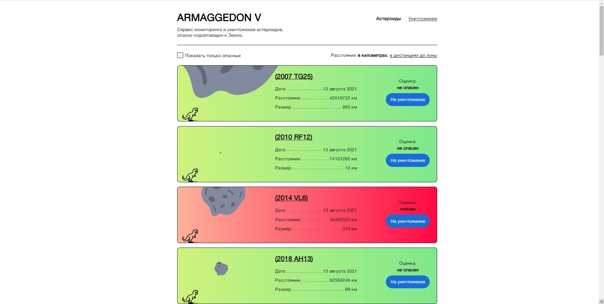
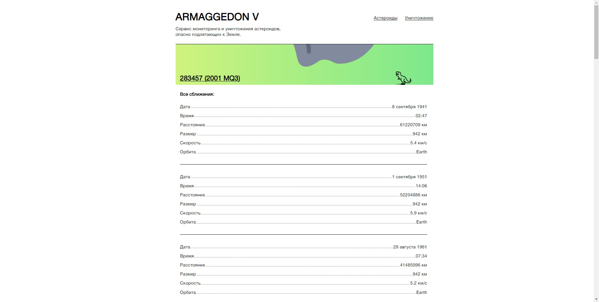
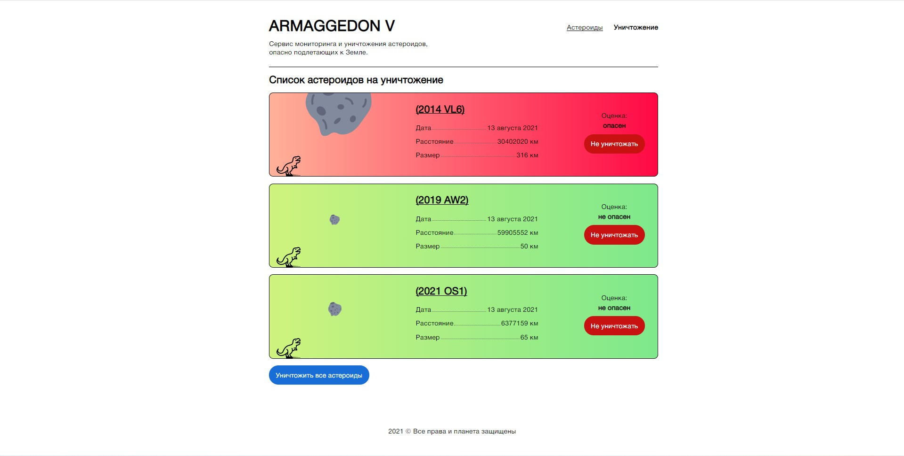

# Проект «Армагеддон-V» 

Сайт из трёх страниц про астероиды. На основе данных API NASA. https://api.nasa.gov Asteroids - NeoWs

Армагеддон-V - SPA с использованием библиотеки React. 
При разработке приложения использовались паттерны реакта: условный рендеринг, прокси, render-prop, children. В проекте использовались функциональные компоненты, Redux, middleware Redux-thunk.

## Описание функциональности
### Страницы приложения
Приложение состоит из нескольких страниц: `Main` (`/`), `Termination` (`/termination`), `Asteroid` (`/asteroids/:id`).

Обращение к несуществующей странице (например, через адресную строку) не приводит к появлению ошибок в приложении, а корректно обрабатывается маршрутизацией. Пользователь перенаправляется на страницу «404».

### Главная страница

На главной странице отображается список подлетов астероидов к Земле от текущей даты в бесконечность. Подгрузка при скролле порциями. 
По каждому астероиду: 
* название, 
* размер, 
* оценка опасности, 
* как близко будет к Земле, 
* точная дата максимального подлёта. 

Размер отображается графически в масштабировании иконки астероида относительно динозавра. 

Фильтр по опасности астероида. И опция вывода расстояний: в километрах или расстояниях до Луны.

Адаптивная вёрстка.

### Страница астероида

На странице астероида отображается подробная информация по астероиду: помимо инфы, перечисленной выше, список всех его сближений. 
По каждому сближению: 
* скорость относительно Земли, 
* время максимального сближения с Землей, 
* расстояние до Земли, 
* по орбите вокруг чего летит.

В списке и на странице астероида есть кнопка добавления астероида в список на уничтожение.

### Список на уничтожение

Список на уничтожение — это некая корзина, где отображаются выбранные подлеты астероидов. В конце страницы кнопка заказа бригады им. Брюса Уиллиса на выбранные астероиды. Бригада будет доставлена на астероид в нужный момент и выполнит свою нелёгкую работу.

---

## Команды

### `npm start`

Запускает приложение в режиме разработчика.

### `npm run build`

Генерирует продакшн сборку приложения в папку `public`. 
Файлы оптимизируются и минифицируются.

### `npm run eslint`

Запускает eslint.